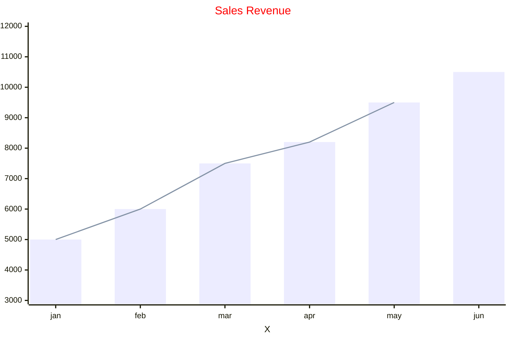
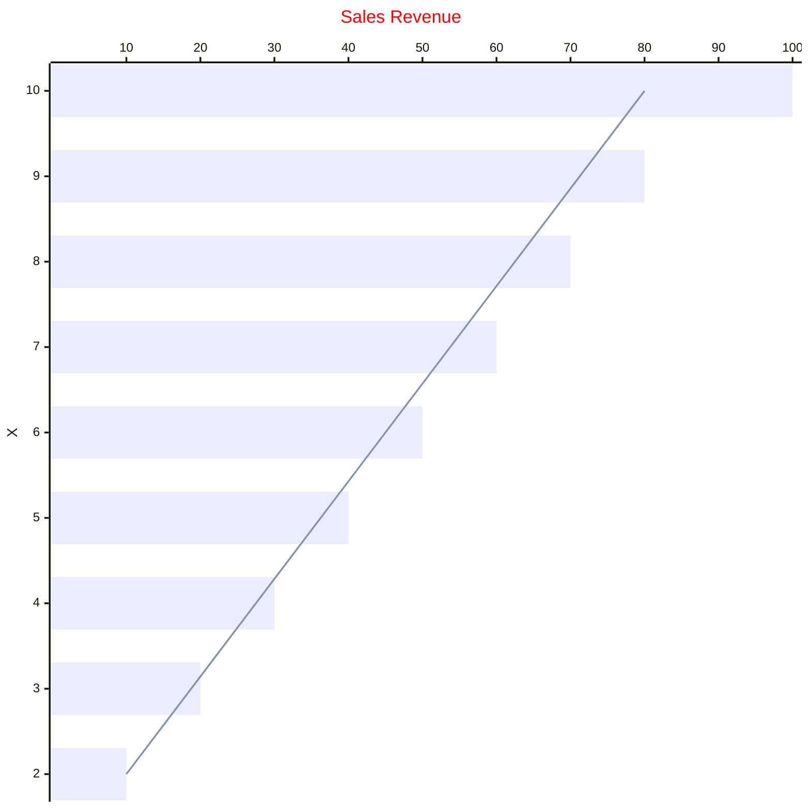

```mermaid
---
config:
    xyChart:
        width: 900
        height: 600
        chartOrientation: vertical
        xAxis:
          showLabel: true
        yAxis:
          showTitle: false
    themeVariables:
        xyChart:
            titleColor: "#ff0000"
---
xychart-beta 
    title "Sales Revenue"
    x-axis X [jan, feb, mar, apr, may, jun]
    y-axis Y 3000 --> 12000
    bar  [5000, 6000, 7500, 8200, 9500, 10500]
    line [5000, 6000, 7500, 8200, 9500]
```

```mermaid
---
config:
    xyChart:
        width: 900
        height: 900
        chartOrientation: horizontal
        xAxis:
          showLabel: true
        yAxis:
          showTitle: false
    themeVariables:
        xyChart:
            titleColor: "#ff0000"
---
xychart-beta 
    title "Sales Revenue"
    x-axis X 2-->10
    y-axis Y 1 --> 100
    bar  [10, 20, 30,40,50,60,70,80,100]
    line [10, 20, 30,40,50,60,70,80]
```

